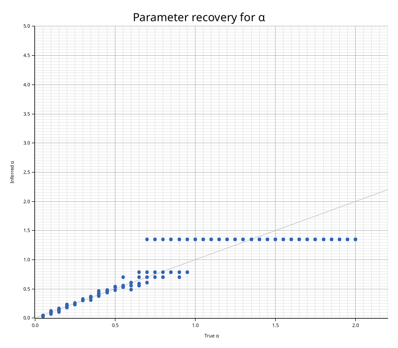
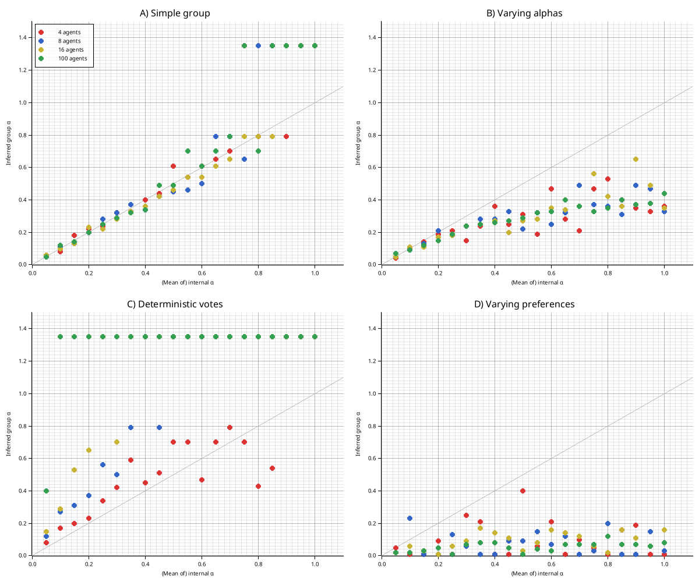
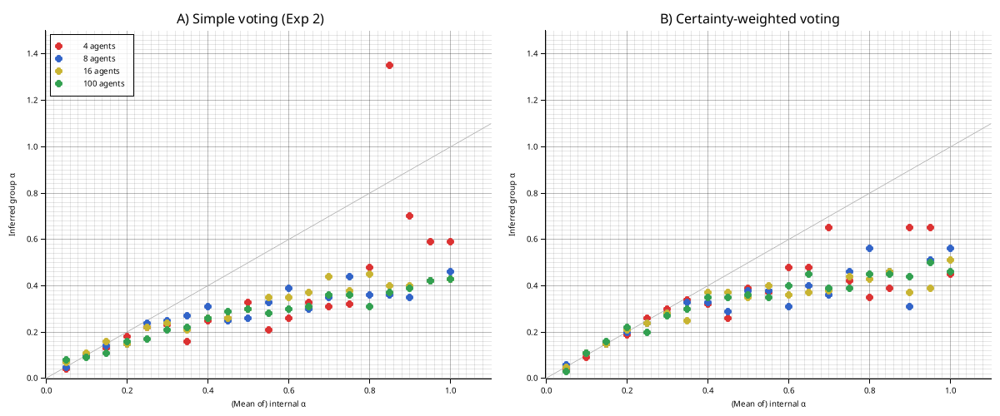

# tira

*(GitHub repo and local dir renamed from `one_many_rs` → `tira` on 2026-05-29; the
Cargo workspace and crate names remain `aif` + `reproduce`.)*

Rust implementation of **"As One and Many: Relating Individual and Emergent Group-Level Generative Models in Active Inference"** (Waade et al., *Entropy* 2025, 27, 143).

Paper: https://doi.org/10.3390/e27020143

See [abstract.md](docs/abstract.md) for a summary of the paper, and
[aif-coverage.md](docs/aif-coverage.md) for the paper→code coverage matrix, the
canonical-AIF parity scorecard, and documented deviations.

Beyond the reproduction, the `aif` crate packages the engine as an **active-inference
coalition-formation strategy** — a competence → expected-free-energy value primitive
([Coalition layer](#coalition-layer-aifcoalition)) consumed by a downstream coalition
runtime, where it is A/B-evaluated against a categorical (magnitude-based) strategy.

## Workspace layout

This is a Cargo workspace with two crates:

| Crate | Role |
|-------|------|
| [`crates/aif`](crates/aif) | Reusable active-inference engine: `POMDPAgent` (A–E matrices, expected free energy, α/γ precision), `GroupAgent` (Markov-blanket nesting), and a `coalition` layer (the `competence_efe` value primitive + trust/compatibility/history beliefs). No plotting or environment coupling — this is the crate downstream projects depend on. The generative-model family is currently MAB-shaped (binary observations, deterministic transitions); see [aif-coverage.md](docs/aif-coverage.md) for the parity matrix and roadmap. |
| [`crates/reproduce`](crates/reproduce) | The paper-reproduction harness: bandit environments, simulation/parameter-recovery, plotting, and the `reproduce` binary. Depends on `aif`. |

## What this does

A collective of active inference agents, arranged in a Markov blanket structure, constitutes a group-level agent with an emergent generative model. This project simulates such collectives on a Multi-Armed Bandit task and uses parameter recovery (cognitive modelling) to infer the group-level action precision α from observed behaviour — then compares it to the individual agents' parameters.

## Results

All four qualitative findings from the paper are reproduced, plus an extension:

| Experiment | Setup | Prediction | Result |
|------------|-------|------------|--------|
| 1 | Identical agents | group α ≈ individual α | Tracks identity line |
| 2 | Varying α (Dirichlet) | Sub-linear scaling | Below identity line |
| 3 | Deterministic voting | Super-linear scaling | Steep increase, saturates with n |
| 4 | Varying preferences (Beta) | Strongly reduced group α | Crushed near 0 |
| 5 | Certainty-weighted voting | More faithful average (§4.1) | Closer to identity than Exp 2 |

### Figure 4 — Parameter Recovery

α recovers well for true α ∈ [0, ~0.6], then degenerates as behaviour becomes fully deterministic.



### Figure 5 — Simulation Experiments



### Figure 6 — Certainty-Weighted Voting vs Simple Voting

Agents report full action distributions; the active agent weights by confidence (exp(-entropy)).
CW voting (right) tracks closer to the identity line than simple probabilistic voting (left).



## Architecture

```
Environment (BanditEnvironment)
     │
     ▼ observation
┌─────────────────────────────────┐
│         GroupAgent              │
│                                 │
│  CopyAgent ──► POMDPAgent ×n   │  ← Markov blanket (Fig. 3)
│  (sensory)     (internal)       │
│                    │ votes      │
│               VotingAgent       │
│               (active)          │
└────────┬────────────────────────┘
         │ group action
         ▼
    Environment
```

| Module | Role |
|--------|------|
| `crates/aif/src/agent.rs` | POMDP active inference agent (A-E matrices, expected free energy G, α/γ precision, `expected_free_energy()`) |
| `crates/aif/src/group.rs` | VotingMode, GroupAgent, VotingAgent (discrete + certainty-weighted), GroupAgentBuilder |
| `crates/aif/src/coalition.rs` | `competence_efe` + `ObsPrecisionParams` (the coalition-value primitive), `CapabilityProvider`, `TrustBeliefs` / `CompatibilityBeliefs` / `CoalitionHistory`, deprecated `CoalitionEvaluator` |
| `crates/aif/src/communication.rs` | Flume-based inter-agent messaging (for extended scenarios) |
| `crates/reproduce/src/simulation.rs` | Simulation runner, parameter recovery (grid search + half-normal prior), 5 experiment factories |
| `crates/reproduce/src/plotter.rs` | Plotters-based scatter helpers (pending consolidation with the binary's figure code) |
| `crates/reproduce/src/bin/reproduce.rs` | Full paper reproduction binary |

## Usage

Run the full reproduction (~16s in release mode):

```sh
cargo run --release -p reproduce --bin reproduce
```

Outputs `plots/figure4_recovery.png`, `figure5_experiments.png`, and `figure6_certainty_weighted.png`.

Run all tests (whole workspace):

```sh
cargo test
```

## Key types

```rust
// Single POMDP active inference agent
let agent = POMDPAgent::new(
    3,                           // n_bandits (states)
    Some(vec![0.8, 0.2, 0.2]),  // A matrix: P(obs1 | bandit)
    None,                        // pA (learning precision)
    vec![0.7, 0.3],             // C: preference for obs1 vs obs2
    None,                        // D: state prior (uniform)
    0.5,                         // α: action precision
    false,                       // learn_a
)?;

// Group agent (Experiment 1: identical agents)
let group = GroupAgentBuilder::new(3)
    .n_internal(16)
    .observation_probs(vec![0.8, 0.2, 0.2])
    .preferences(vec![0.7, 0.3])
    .alpha(0.5)
    .deterministic(false)  // true for Experiment 3
    .build_identical()?;

// Certainty-weighted voting (Extension 5)
let cw_group = GroupAgentBuilder::new(3)
    .n_internal(16)
    .observation_probs(vec![0.8, 0.2, 0.2])
    .preferences(vec![0.7, 0.3])
    .alpha(0.5)
    .certainty_weighted(true)
    .build_identical()?;

// Run simulation and recover group-level α
let (data, result) = experiment_identical(16, 0.5, 300)?;
println!("Group α = {:.3}", result.estimated_alpha);
```

## Coalition layer (`aif::coalition`)

The `aif` crate exposes a domain-agnostic **coalition-value primitive** for downstream
coalition runtimes: **`competence_efe(c, params)`** maps a scalar competence `c ∈ [0,1]` to
expected free energy `G` via the observation-model precision, so coalition value stays
non-degenerate as membership changes. This is the **supported bridge** a downstream
`ValueCalculator` consumes — koalisi's `EfeValueCalculator` delegates to it:

```rust
use aif::{competence_efe, ObsPrecisionParams};

// Returns Result<f64, AifError>; params passed by value (Copy).
let g = competence_efe(0.8, ObsPrecisionParams::default())?; // lower G = higher coalition value
```

`belief_weighted_preference(...)` derives a preference vector from the normalized
`TrustBeliefs` / `CompatibilityBeliefs` / `CoalitionHistory` structs, connecting beliefs to
the decision surface.

> **Deprecated:** the earlier `CoalitionEvaluator` (`decide_join` = join iff coalition `G <`
> individual `G`) is the per-agent, *preference-based* variant — its observation model is
> membership-blind, so a preference shift moves `G` only under a low-discriminability model
> (near-degenerate in practice), and downstream consumers bypass it. Prefer `competence_efe`;
> removal tracked in [issue #1](https://github.com/sustia-llc/tira/issues/1).

## Dependencies

| Crate | Purpose |
|-------|---------|
| nalgebra | Matrix operations for POMDP |
| rand / rand_distr | Sampling, Dirichlet, Beta distributions |
| rayon | Parallel parameter sweeps |
| plotters | Figure generation |
| flume | Inter-agent message channels |
| thiserror | Error types |
| serde | Trial data serialization |
